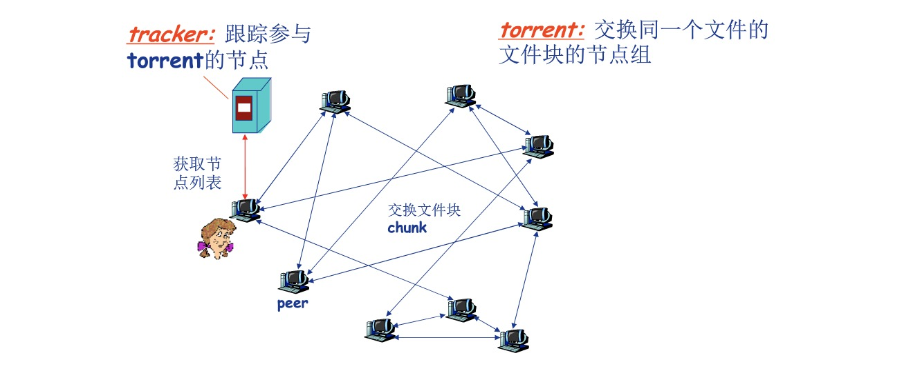

# Socket编程-应用编程接口(API)

应用进程的控制权和操作系统的控制权进行转换的一个系统调用接口
应用进程间通信的抽象机制

## Socket API


- 标识通信端点(对外)
  - IP地址+端口号 （端点地址）
- 操作系统/进程如何管理套接字(对内)
  - 套接字描述符(socket description)
    - 小整数

## Socket抽象


- 类似于文件的抽象
- 当应用进程创建套接字时，操作系统分配一个数据结构存储该套接字相关信息
- 返回套接字描述符

### 地址结构

```c++
struct sockaddr_in
{
    u_char sin_len;         /*地址长度 */
    u_short sin_family;     /*地址族(TCP/IP:AF_INET)*/
    u_short sin_port;       /*端口号*/
    struct in_addr sin_addr;/*IP地址*/
    char sin_zero[8];       /* 未用(置0)*/
}
```

使用TCP/IP协议簇的网络应用程序声明端点地址变量时，使用结构sockaddr_in

## WinSock


- WSAStartup int WSAStartup(WORD wVersionRequested,LPWSADATA IpWSAData)
  - 使用Socket的应用程序在使用Socket之前必须首先调用WSAStartup函数
  - 两个参数
    - 第一个参数指明程序请求使用的WinSocket版本，其中高位字节指明副版本,地位字节指明主版本
      - 16位进制数，例如0X102标识2.1版
    - 第二个参数返回实际的WinSock的版本信息
      - 指向WSADATA结构的指针

使用2.1版本的WinSock的程序代码段

  ```c
wVersionRequested=MAKEWORD(2,1);
      err=WSAStartup(wVersionRequested,&wsaDat);
  ```

### WSACleanup int WSACleanup(void)

- 应用程序在完成对请求的Socket库的使用，最后要调用WSACleanup函数
- 解除与Socket库的绑定
- 释放Socket库所占用的系统资源

### socket sd=socket(protofamily,type,proto)


- 创建套接字
- 操作系统返回套接字描述符(sd);
- 第一个参数(协议族):protofamily=PF_INEN(TCP/IP)
- 第二个参数(套接字类型)
  - type=SOCK_STREAM(TCP),SOCK_DGRAM(UDP) or SOCK_RAW(IP/ICMP/IGMP)网路层 需要特殊权限
- 第三个参数(协议号):0为默认

创建一个流套接字的代码段

```c++
 struct protoent*p;
 p=getprotobyname("tcp");
 SOCKET sd=socket(PF_INET,SOCK_STREAM,p->p_proto);

```

### Socket面向TCP/IP的服务类型

- type=SOCK_STRRAM对应是传输层的TCP，可靠，面向连接，字节流传输，点对点
- type=SOCK_DGRAM对应是传输层的UDP，不可靠，无连接，数据包传输

### Closesocket int closesocket(SOCKET sd)

- 关闭一个描述符为sd的套接字
- 如果多个进程共享一个套接字，调用closesocket将套接字引用计数减一，减到0才关闭
- 一个进程中的多个线程对一个套接字的使用无计数
  - 如果进程中的一个线程调用closesocket将一个套接字关闭，该进程中的其他线程也将不能访问该套接字
- 返回值:0成功，SOCKET_ERROR 失败

### bind int bind(sd,localaddr,addrlen)

- 绑定套接字的本地端点地址:IP地址+端口号
- 参数
  - 套接字描述符sd
  - 端点地址localaddr
    - 结构socketaddr_in
- 客户端一般不必调用bind函数,操作系统会帮助客户端设置本地地址以及端口
- 服务器端需要熟知的端口号例如 web服务器80，smtp25，IP地址使用地址通配符INADDR_ANY为了处理服务主机通过两个网卡连接不同的网络时IP地址的选择

### listen int listen(sd,queuesize)

- 置服务端的流套接字处于监听状态
  - 仅服务器端调用
  - 仅用于面相连接的流套接字
- 设置连接请求队列大小(queuesize)
  - 返回值:0成功，SOCKET_ERROR 失败

### connect(sd,saddr,saddrlen)

- 客户端程序调用connect函数来使客户端套接字sd与特定计算机的特定端口saddr的套接字服务进行连接
- 仅用于客户端
- 可用于TCP客户端也可用于UDP客户端
  - TCP客户端:建立TCP连接
  - UDP客户端:指定服务器端点地址

### accept newsock=accept(sd,caddr,caddrlen)

- 服务器程序调用accept函数从处于监听状态的流套接字sd的客户连接请求队列中取出排在最前的一个客户请求，并且创建一个新的套接字来与客户端套接字创建连接通道
  - 仅用于TCP套接字
  - 仅用于服务器
- 利用新创建的套接字newsock与客户端通信
  - TCP连接是点对点，意味着一个TCP连接只能连接客户端和服务器端的两个套接字，如果有其他的客户端请求，服务器的套接字就不能再与其他的客户端套接字建立连接了，也就造成了TCP服务器只能在某一个时刻和某一个客户端套接字建立连接，也就不能做到并发的TCP服务器了，因此需要新的套接字

### send(sd,*buf,len,flags),sendto(sd,*buf,len,flags,destaddr,addrlen)

- send函数TCP套接字(客户端与服务器)或调用了connect函数的UDP客户端套接字
- sendto函数用户UDP服务器端套接字与未调用connect函数的UDP客户端套接字

### recv(sd,*buffer,len,flags),recvfrom(sd,*buf,len,flags,senderaddr,saddrlen)

- recv函数从TCP连接的另一端接收数据，或者从调用了connect函数的UDP客户端套接字接收服务器发来的数据

- recvfrom函数用于从UDP服务器端套接字与未调用connect函数的UDP客户端套接字接收对端数据

### int setsockopt(int sd,int level,int optname,*optval,int optlen),int getsocketopt(int sd,int level,int optname,*optval,socket_t*optlen)

- setsocketopt()函数用来设置套接字sd的选项参数
- getsocketopt()函数用于获取任意类型，任意状态套接字的选项当前值，并把结果存入optval

## Socket API 函数小结

- WSAStartup:初始化socket库仅对Winsock
- WSACleanip:中止socket库的使用仅对Winsock
- socket:创建套接字
- connet:“连接”远程服务器(仅用于客户端)
- closesocket:释放/关闭套接字
- bind:绑定套接字的本地IP地址和端口号(通常客户端不需要)
- listen:置服务器TCP套接字为监听模式，并设置队列大小仅用于服务器端TCP套接字
- accept:接收/提取一个连接请求，创建新套接字，通过新套接字(仅用于服务器端的TCP套接字)
- recv:接收数据(用于TCP套接字或连接模式的客户端UDP套接字也就是调用了connect函数的UDP)
- recvfrom:接收数据包(用于非连接模式的UPD套接字)
- send:发送数据(用于TCP套接字或连接模式的客户端UDP套接字)
- sendto:发送数据包(用于非连接模式的UDP套接字)
- setsocket:设置套接字选项参数
- getsocket:获取套接字选项参数

### 网络字节顺序

- TCP/IP定义了标准的用于协议头中的二进制数表示:网络字节顺序(network byte order)
- 某些Socket API函数的参数需要存储为网络字节顺序(IP地址，端口号)
- 可以实现本地字节顺序与网络字节顺序间转换的函数
  - htons:本地——>网络 (16bits)
  - ntohs:网络->本地
  - htonl:本地——>网络 (32bits)
  - ntohl:网络->本地

### 网络应用的Socket API(TCP)调用基本流程


### 解析服务器IP地址

- 客户端可能使用域名如 baidu.com 或者 202.108.22.5标识服务器
- IP协议需要使用32位二进制IP地址
- 需要将域名或IP地址转换为32位IP地址
  - 函数inet_addr()实现点分十进制IP地址到32位IP地址转换
  - 函数gethostbyname()实现域名到32位地址转换
    - 返回一个结构指针hostent的指
    

### 解析服务器(熟知)端口号

- 客户端还可能使用服务名(如HTTP)标识服务器端口
- 需要将服务名转换为熟知端口号
  - 函数getservbyname()
    - 返回一个指向结构servent的指针
    

### 解析协议号

- 客户端可能使用协议名(如:TCP)指定协议
- 需要将协议民转换为协议号(如:6)
  - 函数getprotobyname()实现协议名到协议号的转换
    - 返回一个指向结构protoent的指针
    

### TCP客户端软件流程

1. 确定服务器IP地址与端口号
1. 创建套接字
1. 分配本地端点地址(IP地址+端口号)这一步系统自动完成
1. 连接服务器套接字
1. 遵循应用层协议进行通信
1. 关闭/释放连接

## UDP客户端软件流程

1. 确定服务器IP地址与端口号
1. 创建套接字
1. 分配本地端点地址(IP地址+端口号)这一步系统自动完成
1. 指定服务器端点地址,构造UDP数据报
1. 遵循应用层协议进行通信
1. 关闭/释放套接字

## 客户端软件的实现不唯一-connectsock()

- 设计一个connectsock过程封装底层代码

  ```c++
  /*consock.cpp - connectsock */
  #include <stdlib.h>
  #include <stdio.h>
  #include <string.h>
  #include <winsock.h>

  #ifndef INADDR_NODE
  #define INADDR_NODE 0xffffffff
  #endif /* INADDR_NODE */
  void errexit(const char*,...);
  /*---------------------------------
   * connectsock -allocate & connect a socket using TCP or UDP
   *---------------------------------
   */

   SOCKET connectsock(const char *host,const char *service,cost char *transport)
   {
     struct hostent *phe;/* pointer to host information entry */
     struct servent *pse;/* pointer to service information entry */
     struct protoent *ppe; /* pointer to protocol information entry */
     struct sockaddr_in sin;/* an Internet endpoint address */
     int s,type;/* socket descriptor and socket type */

     memeset(&sin,0,size(sin));
     sin.sin_family=AF_INET;

     /* Map service name to port number */
     if(pse=getservbyname(service,transport))
        sin.sin_port=pse->s_port;
      else if((sin.sin_port=htons((u_short)atoi(service)))==0)
           errexit("can't get \"%s\" service entry\n",service);
    /* Map host name to IP address,allowing for dotted decimal */
    if(phe=gethostbyname(host))
       memcpy(&sin.sin_addr,phe->h_addr,phe->h_length);
    eles if((sin.sin_addr.s_addr=inet_addr(host))==INADDR_NODE)
         errexit("cant't get \"%s\" host entry\n",host);
    /* Map protocol name to protocol number */
    if((ppe=getprotobyname(transport))==0)
         errexit("cant't get \"%s\" protocol entry\n",transport);
    /* Use protocol to choose a socket type */
    if(strcmp(transport,"udp")==0)
            type=SOCK_DGRAM;
    else
             type=SOCK_STREAM;
    /* Allocate a socket */
    s=socket(PF_INET,type,ppe->p_proto);
    if(s==INVALID_SOCKET)
        errexit("cant't create socket:%d\n",GetLastError());
    /* Connect the socket */
    if(connect(s,(struct sockaddr *)&sin,sizeof(sin))==SOCKET_ERROR)
        errexit("can't connect to %s.%s:%d\n",host,service,GetLastError());
        return s;
   }

  ```

  - 设计connectUDP过程用于创建连接模式客户端UPD套接字

  ```c++
  /* conUDP.cpp - connectUDP */
  #include <winsock.h>
  SOCKET connectsock(const char *,cost char *,const char *)
  /*------------------------------------------
   * connectUDP - connect to a specified UDP service on a specified host
  *-------------------------------------------
  */
  SOCKET conectUDP(const char *host,const char *service)
  {
    return connectsock(host,service,"udp");
  }
  ```

  - 设计connectTCP过程用于创建连接模式客户端UPD套接字

 ```c++
  /* conTCP.cpp - connectTCP */
  #include <winsock.h>
  SOCKET connectsock(const char *,cost char *,const char *)
  /*------------------------------------------
   * connectTCP - connect to a specified TCP service on a specified host
  *-------------------------------------------
  */
  SOCKET conectTCP(const char *host,const char *service)
  {
    return connectsock(host,service,"tcp");
  }
  ```

## 客户端软件的实现-异常处理

 ```c++
  /* errexit.cpp -  errexit */
  #include <stdarg.h>
  #include <stdio.h>
  #include <stdlib.h>
  #include <winsock.h>

  /*------------------------------------------
   * connectUDP - connect to a specified UDP service on a specified host
  *-------------------------------------------
  */
/* VARARGS1 */
 void errexit(const char *format,...)
 {
   var_list args;
   va_start(args,format);
   vfprintf(stderr,format,args);
   va_end(args);
   WSACleanup();
   exit(1);
 }
  ```

## 访问DAYTIME服务的客户端(TCP)

- DAYTIME服务
  - 获取日期和时间
  - 双协议服务(TCP,UDP),端口号13
  - TCP版利用TCP连接请求出发服务
  - UDP版需要客户端发送一个请求数据报

  ```c++
  /* TCPdtc.cpp -main,TCPdaytime */
  #include <stdlib.h>
  #include <stdio.h>
  #include <winsock.h>

  void TCPdaytime(const char *,const char *);
  void errexit(const char *,...);
  SOCKET connectTCP(const char *,const char *);

  #define LINELEN 128
  #define WSVERS MAKEWORD(2,0)
  /*-------
  * main - TCP client for DAYTIME service
  *-------
  */
  int main(int argc, char const *argv[])
  {
    char *host="localhost"; /* host to use if none supplied */
    char *service="datytime"; /* default service port */
    WSADATA wsadta;
    switch (argc){
      case 1:
          host="localhost";
          break;
      case 3:
          service=argv[2];
          /* FALL THROUGH */
      case 2:
          host=argv[1];
          break;
      default:
              fprintf(stderr, "usage:TCPdaytime [host [port]]\n");
              exit(1);
    }
    if(WSAStartup(WSVERS,&wsadta)!=0)
      errexit("WSAStartup failed\n");
    TCPdaytime(host,service);
    WSAStartup();
    return 0;   /* exit */
  }

  /*-------
  * TCPdaytime - invoke Daytime on specified host and print results
  *-------
  */
  void TCPdaytime(const char *host.const char *service)
  {

      char buf[LINELEN+1]; /* buffer for one line of text */
      SOCKET s; /*socket descriptor */
      int c; /* recv character count*/
      s=connectTCP(host,service);
      cc=recv(s,buf,LINELEN,0);
      while(cc!=SOCKET_ERROR && cc>0)
      {
        buf[cc]='\0'; /* ensurr null-termination*/
        (void) fprintf(buf, stdout);
        cc=recv(s,buf,LINELEN,0);
      }
      closesocket(s);
  }

  ```

## 访问DAYTIME服务的客户端(UDP)

```c++
  /* UDPdtc.cpp -main,UDPdaytime */
  #include <stdlib.h>
  #include <stdio.h>
  #include <winsock.h>

  void IDPdaytime(const char *,const char *);
  void errexit(const char *,...);
  SOCKET connectUDP(const char *,const char *);

  #define LINELEN 128
  #define WSVERS MAKEWORD(2,0)
  /* because the server does't kown
  *  a client connect to it in use udp so the udp client has to 
  *  send a mesage to server
  */
  #define MSG "what daytime is now?\n"


  /*-------
  * main - UPD client for DAYTIME service
  *-------
  */
  int main(int argc, char const *argv[])
  {
    char *host="localhost"; /* host to use if none supplied */
    char *service="datytime"; /* default service port */
    WSADATA wsadta;
    switch (argc){
      case 1:
          host="localhost";
          break;
      case 3:
          service=argv[2];
          /* FALL THROUGH */
      case 2:
          host=argv[1];
          break;
      default:
              fprintf(stderr, "usage:UDPdaytime [host [port]]\n");
              exit(1);
    }
    if(WSAStartup(WSVERS,&wsadta)!=0)
      errexit("WSAStartup failed\n");
      UDPdaytime(host,service);
      WSAStartup();
    return 0;   /* exit */
  }


  /*-------
  * TCPdaytime - invoke Daytime on specified host and print results
  *-------
  */
  void UDPdaytime(const char *host.const char *service)
  {

      char buf[LINELEN+1]; /* buffer for one line of text */
      SOCKET s; /*socket descriptor */
      int n; /* recv character count*/
      s=connectUDP(host,service);
      (void)send(s,MSG,strlen(MSG),0);
      n=recv(s,buf,LINELEN,0);
      /* different from tcp it use as the MSG can send by a datagram */
      if(n!=SOCKET_ERROR)
        errexit("recv failed:recv() error %d\n",GetLastError());
      {
        buf[cc]='\0'; /* ensurr null-termination*/
        (void) fprintf(buf, stdout);
      }
      closesocket(s);
      return 0; /* exit*/

  }
```

## Socket编程-服务器端软件设计

- 数据发送
  - 服务器端不能使用connect()函数
    - 无连接服务使用sendto()函数发送数据报
    - retcode=sendto(socket,data,length,flags,destaddr,addrlen)

      
      - destaddr是指向结构socketaddr_in的指针(客户端端点地址)
  - 获取客户端点地址
    - 调用recvfrom()函数接收数据时，自动提取
    - retcode=recvfrom(sd,*buf,len,flags,senderaddr,saddrlen)
      - from 存放源地址的缓存地址

      
- 循环无连接iterative connectionless
  - 流程
    1. 创建套接字
    1. 绑定端点地址(INADDR_ANY+端口号)
    1. 反复接收来自客户端的请求
    1. 遵循应用层协议，构造响应报文，发送个客户
- 循环面向连接iterative connection-oriendted
  - 流程
    1. 创建(主)套接字，并绑定熟知端口号
    1. 设置(主)套接字为被动监听模式，准备用于服务器
    1. 调用accept()函数接收下一个连接请求(通过主套接字),创建新套接字用于与该客户端建立连接
    1. 遵循应用协议，反复接收客户请求，构造并发送响应(通过新套接字)
    1. 完成特定客户端服务后，关闭与该客户之间的连接，返回步骤3
- 并发无连接concurrent connectionless
  - 流程
    1. 主线程1:创建套接字，并绑定熟知端口号
    1. 主线程2:反复调用recvfrom()函数,接收下一个客户请求，并创建新线程处理该客户响应
    1.子线程1:接收一个特定请求
    1. 子线程2:依据应用层协议构造响应报文，并调用sendto()发送
    1. 子线程3:退出(一个字线程处理一个请求后即终止)
- 并发面向连接concurrent connection-oriented
  - 流程
    1. 主线程1:创建(主)套接字，并绑定熟知端口号
    1. 主线程2:设置(主)套接字为被动监听模式，准备用于服务器
    1. 主线程3:反复调用accept()函数接收下一个连接请求(通过主套接字),并创建一个新的子线程处理该客户响应
    1. 子线程1:接受一个客户的服务请求(通过新创建的套接字)
    1. 子线程2:遵循应用层协议月特定客户进行交互
    1. 子线程3:关闭/释放连接并推出(线程终止)

## 服务器端的实现

- 设计一个底层过程隐藏底层代码
  - passivesock()
   
- 两个高层过程分别用于创建服务器端UDP套接字和TCP套接字(调用passivesock()函数)
  - passiveUDP()
   
  - passiveTCP()
     

## 无连接循环DATTIME服务器


## 面向连接并发DATTIME服务器


