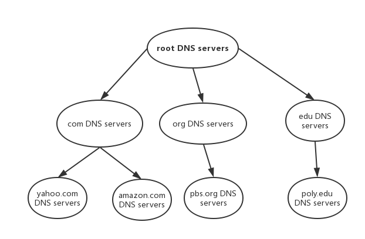
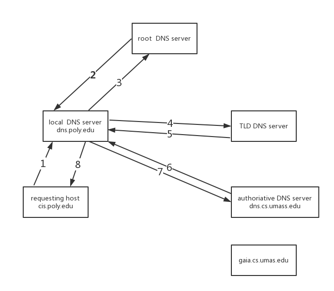

# DNS:Domain Name System

## Internet上主机/路由器的识别问题

- IP地址 <http://202.108.22.5/>
- 域名:www.baidu.com

因此域名和IP地址之间如何映射就显得尤为重要

## 域名解析系统DNS

- 多层命名服务器构成的分布式数据库
- 应用层协议:完成名字的解析
  - Internet核心功能,用应用层协议实现
  - 网络边界复杂

## DNS服务

- 域名向IP地址的翻译
- 主机别名
- 邮件服务器别名
- 负载均衡:Web服务器

## DNS使用集中式方式的缺点

- 单点失败问题
- 流量问题
- 距离问题
- 维护性问题

## 分布式层次式数据库

客户端想要查询 www.amazon.com的IP

- 客户端查询根服务器也就是root dns servers,通过它找到com域名解析服务器
- 客户端查询com域名解析服务器，找到amazon.com域名解析服务器
- 客户端查询 amazon.com域名解析服务器，获得 www.amazon.com 的IP地址

## DNS根域名服务器

本地域名服务器无法解析域名时，访问根域名服务器

根域名服务器

- 如果不知道映射，访问权威域名服务器
- 获得映射
- 向本地域名服务器返回映射

## TLD和权威域名解析服务器

- 顶级域名服务器TLD top-level domain负责com,org,net,edu等顶级域名和国家顶级域名例如cn,uk,fr等

  - Network Solution维护com顶级域名服务器
  - Educause维护edu顶级域名服务器

- 权威(Authoritative)域名服务器--组织的域名解析服务器，提供组织内部服务器的解析服务
  - 组织负责维护
  - 服务提供商负责维护

## 本地域名解析服务器

不严格属于层级体系

- 每个ISP有一个本地域名服务器
  - 默认域名解析服务器

- 当主机进行DNS查询时，查询被发送到本地域名服务器
  - 作为代理proxy，将查询转发给层级式域名解析服务器系统

## DNS查询实例

Cis.poly.edu的主机想获得gaia.cs.umass.edu的IP地址

- 迭代查询

    
  1. 访问本地域名解析服务器
  1. 本地域名解析服务器代理去访问根域名服务器
  1. 根域名返回顶级域名服务器的地址给本地域名解析服务器
  1. 本地域名解析服务器访问顶级域名服务器
  1. 顶级域名服务器返回umass.edu的权威域名解析服务器
  1. 本地域名解析服务器访问umass.edu权威域名解析服务器
  1. umass.edu权威域名解析服务器返回gaia.cs.umass.edu的IP地址给本地域名解析服务器
  1. 本地域名解析服务器返回gaia.cs.umass.edu的IP地址给Cis.polu.edu主机

- 递归查询--将域名解析的任务交给所联系的服务器

从上面两种查询方式来看，迭代查询把压力都给了根域名服务器，而递归查询把压力都给了本地域名服务器

## DNS记录缓存和更新

只要域名解析服务器获得域名-IP映射，即缓存这一映射

- 一段时间后，缓存条目失效(删除)
- 本地域名服务器一般会缓存顶级域名服务器的映射
  - 因此根域名服务器不经常访问

## DNS记录和消息格式

- 资源记录(RR resource records) RR format:(name,value,type,ttl)
  - type=A
    - Name:主机域名
    - Value:IP地址
  - type=NS
    - Name:域(edu.cn)
    - Value:该域权威域名解析服务器的主机域名
  - type=CNAME
    - Name:某一真实域名的别名例如www.ibm.com-servereast.backup2.ibm.com
    - Value:真实域名

  - type=MX
    - Value是与name相对应的邮件服务器

- DNS协议
  - 查询query和回复reply消息
  - 消息格式相同
- 消息头部
  - identification:16位查询编号，回复使用相同编号
  - flags
    - 查询或回复
    - 期望递归
    - 递归可用
    - 权威回答

- 注册域名Network Utopia
  - 在域名管理机构注册域名networkutopia.com
  - 向域名管理机构提供你的权威域名解析服务器的名字和IP地址
  - 域名管理机构向com顶级域名解析服务器插入两条记录
    - (networkutopia.com,dns1.networkutopia.com,NS)
    - (dns1.networkutopia.com,212.212.212.1,A)
  - 在权威域名解析服务器中为www.networkutpopia.comj加入Type A记录,为networkuptpopia.com加入Type MX记录