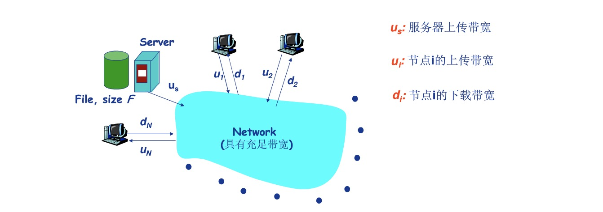
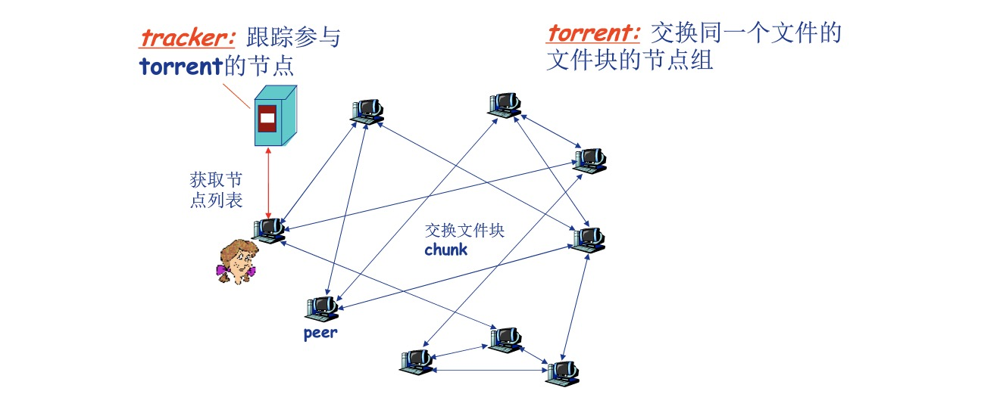

# P2P应用

## 原理与文件分发

### 纯P2P架构

- 没有服务器
- 任意端系统之间直接通信
- 节点阶段性介入Internet
- 节点可能更换IP地址

### 文件分发

- 客户端/服务器 VS P2P

    从一个服务器向N个节点分发一个文件需要多长时间?

  - 客户端/服务器

      

    - 服务器串行地发送N个副本时间:NF/$u_s$
    - 客户端i需要F/{d_i}时间下载

    因此使用客户端/服务器需要的时间是$d_{cs}$=max{NF/$u_s$,F/min($d_i$)},随着N增大线性增长

  - 文件分发:P2P

    - 服务器必须发送一个副本时间:F/$u_s$
    - 客户端i需要F/$d_i$时间下载
    - 总共需要下载NF比特
    - 最快的可能上传速率:$u_s+\sum u_i$

    因此使用P2P需要的时间是$d_{P2P}=max\{F/u_s,F/min(d_i),NF/(u_s+\sum u_i) \}$

- BitTorrent

    
    - 文件划分256KB的chunk
    - 节点加入torrent
      - 没有chunk,但是会逐渐积累
      - 向tracker注册以获得节点清单,与某些节点(邻居)建立连接
    - 下载的同时,节点需要向其他节点上传chunk
    - 节点可能加入或离开
    - 一旦节点获得完整的文件,它可能停止上传chunk或者继续上传chunk
    - 获取chunk
      - 给定任一时刻，不同的节点只有文件的不同chunk集合
      - 节点定期查询每个邻居所持有的chunk列表
      - 节点发送请求,请求获取确实的chunk，稀缺chunk优先获取
      - 发送chunk
        - 节点向4个邻居节点发送chunk:正在向其发送chunk,速率最快的4个，并且没10秒重新评估top4
        - 每30秒随机选择一个其他节点,向其发送chunk
          - 新选择节点可能加入top4

    因此带来的结果就是长传速率高，则能获得更好的传输连接节点，从而更快的获取文件