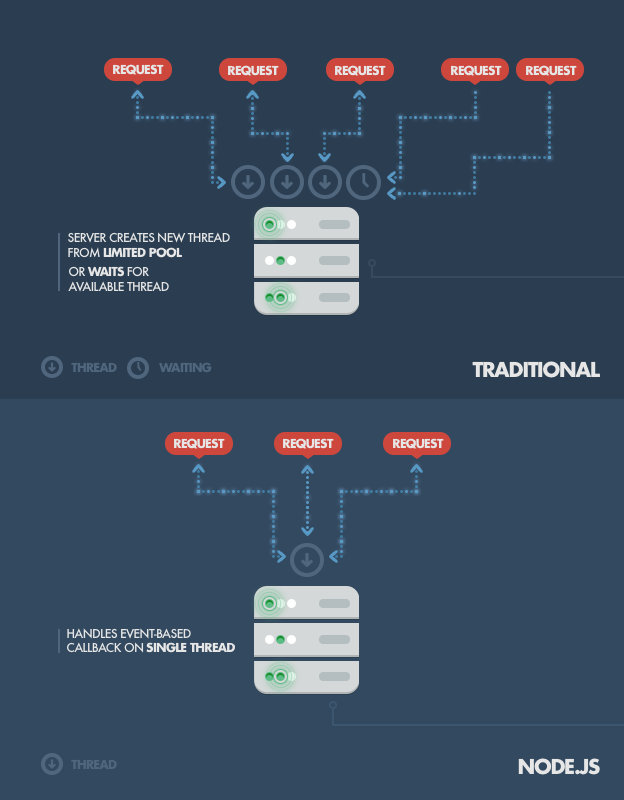

# Node.js概述

## Node.js是如何工作的

- Node.js 的主要思路是：使用非阻塞的，事件驱动的 I/O 操作来保持在处理跨平台(across distributed devices) 数据密集型实时应用时的轻巧高效

## Node.js的工作原理

- 传统的网络服务技术，是每个新增一个连接（请求）便生成一个新的线程，这个新的线程会占用系统内存，最终会占掉所有的可用内存。而 Node.js 仅仅只运行在一个单线程中，使用非阻塞的异步 I/O 调用，所有连接都由该线程处理，在 libuv 的加分下，可以允许其支持数万并发连接（全部挂在该线程的事件循环中）
- 做一个简单的计算: 假设是普通的Web程序，新接入一个连接会占用 2M 的内存，在有 8GB RAM的系统上运行时, 算上线程之间上下文切换的成本，并发连接的最大理论值则为 4000 个。这是在传统 Web服务端技术下的处理情况。而 Node.js 则达到了约 1M 一个并发连接的拓展级别 .
- 在所有客户端的请求共享单一线程时也会有问题, 这也是一个编写 Node.js 应用的潜在缺陷. 首先, 大量的计算可能会使得 Node 的单线程暂时失去反应, 并导致所有的其他客户端的请求一直阻塞, 直到计算结束才恢复正常,目前我们的蓝牙锁这种应用场景是不会有CPU密集运算的
